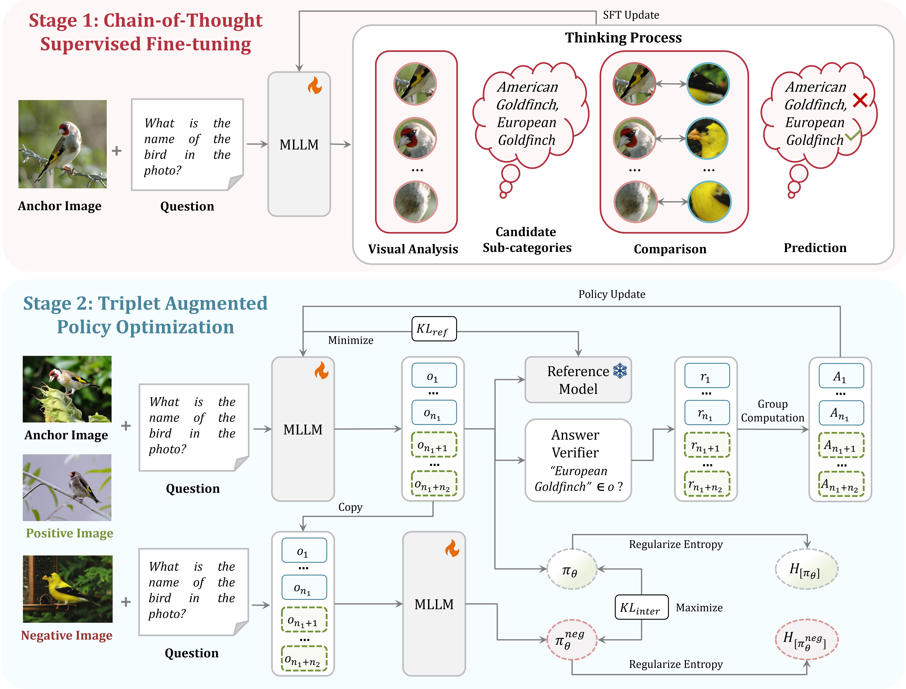
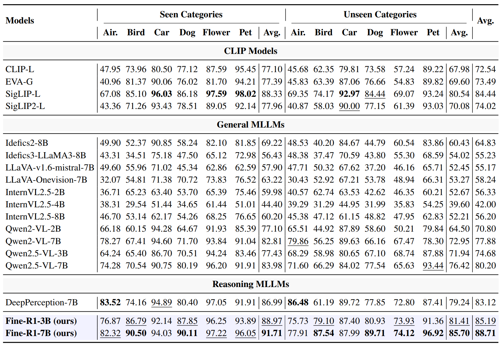

<!-- PROJECT LOGO -->

<p align="center">
  <h1 align="center">Fine-R1: Make Multi-modal LLMs Excel in Fine-Grained Visual Recognition by Chain-of-Thought Reasoning</h1>
  <p align="center">
    <a href="http://39.108.48.32/mipl/news/news.php?id=EGhehulingxiao"><strong>Hulingxiao He</strong></a>
    ·
    <a href="http://39.108.48.32/mipl/news/news.php?id=EGgengzijun"><strong>Zijun Geng</strong></a>
    ·
    <a href="http://39.108.48.32/mipl/yuxinpeng/"><strong>Yuxin Peng</strong></a>
  </p>
  <h2 align="center">ICLR 2026</h2>
<div align="center"></div>


  <h3 align="center"><a href="https://arxiv.org/abs/2602.07605">Paper</a> | <a href="https://huggingface.co/collections/StevenHH2000/fine-r1">Models</a>


</div>

## 🔥 News 
- **Feb 2026:** Code, data, and models are released. 
- **Jan 2026:** Fine-R1 is accepted to ICLR 2026.

## 🌟 **Key Highlights**

- **To the best of our knowledge, our Fine-R1 is the first MLLM to surpass various strong CLIP-like models (e.g., SigLIP-L) in FGVR**: It's widely acknowledged that general MLLMs underperform contrastive models like CLIP/SigLIP on fine-grained tasks. Our work bridges this gap and strongly indicates the potential of generative MLLMs for discriminative vision tasks.

<div align="center">

</div>

## 📖 **Methodology**

**Fine-R1** generates Chain-of-Thought (CoT) before producing the final fine-grained visual
recognition (FGVR) answer. It utilizes **CoT supervised fine-tuning (SFT)** and **Triplet Augmented
Policy Optimization (TAPO)**, learning the reasoning process with only few-shot samples per category.

<div align="center">

</div>

### **Main Results**

(1) **Closed-world evaluation**: In comparison to general and reasoning MLLMs, and contrastive CLIP models, Fine-R1 excels in identifying both seen and unseen categories:

<div align="center">

</div>

(2) **Open-world evaluation**: Fine-R1 establishes new state-of-the-art performance with only 4-shot training samples per sub-category, achieving 74.80% relative semantic similarity on average:

<div align="center">

</div>

## 🚀 **Quick Start**

## **Stage1: CoT SFT**

### **(1) Environment Setup**

Please follow the instructions to set up the training environment: https://github.com/hiyouga/LLaMA-Factory. We recommend creating a new conda environment specifically for this stage to avoid potential package version conflicts.


### **(2) Data Preparation**

1. Download and prepare the training images of 6 FGVR datasets:
  - FGVC-Aircraft ✈️
  - CaltechUCSD Bird-200 🦤
  - Stanford Car-196 🚙
  - Stanford Dog-120  🐕
  - Flower-102  🌼
  - Oxford-IIIT Pet-37 🐈
2. Update image paths in the JSON files `FineR1_ICLR2026/LLaMA-Factory/data/Fine-R1-Stage1-data.json` to point to your image directory.

### **(3) Training**

```bash
# 3B model
cd LLaMA-Factory
bash cot_sft_3b.sh

# 7B model  
cd LLaMA-Factory
bash cot_sft_7b.sh
```

## **Stage2: TAPO**

### **(1) Environment Setup**

#### **Option 1: All-in-one Installation Script**
```bash
conda create -n tapo python=3.10
conda activate tapo

cd TAPO
bash scripts/install.sh
```

#### **Option 2: Using pip**
```bash
conda create -n tapo python=3.10
conda activate tapo

cd TAPO
pip install -e .
pip install flash-attn==2.7.3 --no-build-isolation
```

### **(2) Training**

The main training pipeline is adopted from [EasyR1](https://github.com/hiyouga/EasyR1). We support training with different configurations for both `Fine-R1-3B` and `Fine-R1-7B` models:

```bash
# 3B model
cd TAPO
bash examples/tapo/tapo_3b.sh

# 7B model  
cd TAPO
bash examples/tapo/tapo_7b.sh
```


## **Performance Evaluation**

We evaluate the models in both closed-world (multi-choice) and open-world (question-answering) FGVR, on both seen and unseen categories.

```bash
# Closed-world evaluation
cd eval
bash scripts/eval_closed.sh

# Open-world evaluation
cd eval
bash scripts/eval_open.sh
```


## 🥰 Acknowledgements

We thank the [PAPO](https://github.com/MikeWangWZHL/PAPO/tree/main), [NoisyRollout](https://github.com/NUS-TRAIL/NoisyRollout/tree/09347ddd88135b83a336a204ecf6353121bbee79), [LlamaFactory](https://github.com/hiyouga/LlamaFactory), and [EasyR1](https://github.com/hiyouga/EasyR1) team for providing the foundational codebase that we adapted to implement Fine-R1. 

## 📝 Citation

```bibtex
@article{he2026finer1,
  title={Fine-R1: Make Multi-modal LLMs Excel in Fine-Grained Visual Recognition by Chain-of-Thought Reasoning},
  author={He, Hulingxiao and Geng, Zijun and Peng, Yuxin},
  journal={arXiv preprint arXiv:2602.07605},
  year={2026}
}
```

## 📄 License

This project is licensed under the MIT License.

---

<div align="center">


</div>